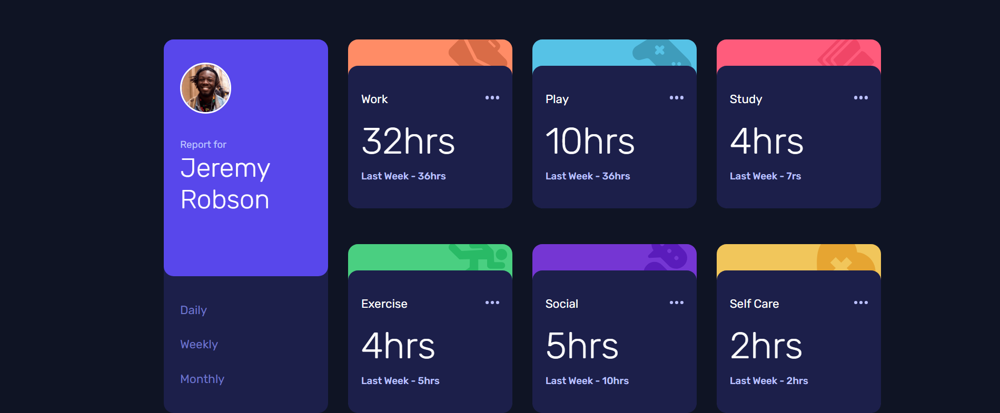

# Time tracking dashboard solution

## Table of contents

- [Overview](#overview)
  - [Features](#features)
  - [Screenshot](#screenshot)
  - [Links](#links)
- [My process](#my-process)
  - [Built with](#built-with)
- [Author](#author)

## Overview

This is a time tracking dashboard component that can be easily changed to fit sites that need it, it shows the time a user spent across 6 categories (Work, Play, Study, Exercise, Social, Selfcare) and it also shows each of these across 3 different time periods (Daily, Weekly, Monthly) in a very nice looking and intuitive UI.

### Features

- Beautiful looking UI with nice transitions that are easy on the eyes.

- Fully responsive for all screen sizes.

- Usage of API to get the JSON data of the user and show it on the user interface seamlessly.

- The user has the ability to see the time he spent across the different categories.

- The user has the ability to see the time spent across different time periods with instant results at the press of a button

### Screenshot

### Links

- [Solution URL](https://www.frontendmentor.io/solutions/time-tracking-dashboard-zzUsrItyZP)
- [Live site](https://safensound95.github.io/time-tracking-dashboard/)

## My process

### Built with

- Semantic HTML5 markup
- CSS3
- Flexbox
- CSS Grid
- Mobile-first workflow
- JavaScript
- API

## Author

- Frontend Mentor - [@SafeNSound95](https://www.frontendmentor.io/profile/SafeNSound95)
- Codewars - [@SafeNSound95](https://www.codewars.com/users/SafeNSound95)
- Exercism - [@SafeNSound95](https://exercism.org/profiles/SafeNSound95)
